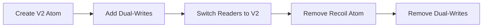

# Design Document: Recoil to Jotai Migration (V2 Dual-Write Approach)

## Overview

This document outlines the design for migrating Twenty's state management from Recoil to Jotai using a **V2 dual-write approach**. This enables component-by-component migration without a big-bang rewrite.

**Why Migrate:**
- Recoil is archived by Meta (no React 19 support)
- Jotai is modern, lightweight, and React 19-compatible
- Smaller bundle size (~3KB vs ~14KB)

**Migration Strategy:**
- Introduce V2 API (Jotai-backed, Recoil-ergonomic)
- Use dual-writes to keep Recoil and Jotai in sync
- Migrate component-by-component starting with ChipFieldDisplay
- Progressive pattern: create V2 atom → add dual-writes → switch readers → remove Recoil

**Current Status:**
- ✅ V2 infrastructure already exists
- ✅ jotaiStore created at `packages/twenty-front/src/modules/ui/utilities/state/jotai/jotaiStore.ts`
- ✅ JotaiProvider wraps RecoilRoot in App.tsx
- ✅ V2 utilities exist: createStateV2, createFamilyStateV2
- ✅ V2 hooks exist: useRecoilValueV2, useRecoilStateV2, useSetRecoilStateV2, useFamilyRecoilValueV2
- ✅ recordStoreFamilyStateV2 created
- ✅ recordIndexOpenRecordInStateV2 created
- ✅ ChipFieldDisplay migrated to V2
- ✅ RecordChip migrated to V2
- ✅ Dual-writes implemented in useUpsertRecordsInStore and useSetRecordTableData

## Architecture

### V2 Dual-Write Architecture

```
┌─────────────────────────────────────────────────────────┐
│                    Migration Phase                       │
│  ┌────────────────────────────────────────────────────┐ │
│  │  V2 API (Jotai-backed) ✅ DONE                     │ │
│  │  - createStateV2 → Jotai atom                      │ │
│  │  - useRecoilValueV2 → useAtomValue                 │ │
│  │  - useRecoilStateV2 → useAtom                      │ │
│  │  - useSetRecoilStateV2 → useSetAtom                │ │
│  └────────────────────────────────────────────────────┘ │
│  ┌────────────────────────────────────────────────────┐ │
│  │  Dual-Write Bridge ✅ PARTIALLY DONE               │ │
│  │  - useUpsertRecordsInStore ✅                      │ │
│  │  - useSetRecordTableData ✅                        │ │
│  │  - ListenRecordUpdatesEffect ❓                    │ │
│  │  - RecordShowEffect ❓                             │ │
│  │  - useLoadRecordIndexStates ❓                     │ │
│  │  - useUpdateObjectViewOptions ❓                   │ │
│  └────────────────────────────────────────────────────┘ │
│  ┌────────────────────────────────────────────────────┐ │
│  │  Legacy Recoil (being phased out)                 │ │
│  │  - Existing atoms remain until migrated           │ │
│  └────────────────────────────────────────────────────┘ │
└─────────────────────────────────────────────────────────┘
```

### Progressive Migration Flow



## Components and Interfaces

### 1. V2 Infrastructure (Already Exists)

The V2 infrastructure is already set up in the codebase:

- **jotaiStore**: `packages/twenty-front/src/modules/ui/utilities/state/jotai/jotaiStore.ts`
- **JotaiProvider**: Wraps RecoilRoot in `packages/twenty-front/src/modules/app/components/App.tsx`
- **createStateV2**: `packages/twenty-front/src/modules/ui/utilities/state/jotai/utils/createStateV2.ts`
- **createFamilyStateV2**: `packages/twenty-front/src/modules/ui/utilities/state/jotai/utils/createFamilyStateV2.ts`
- **V2 Hooks**: Located in `packages/twenty-front/src/modules/ui/utilities/state/jotai/hooks/`

### 2. V2 API Pattern

#### State Creation

```typescript
// Simple state
const myStateV2 = createStateV2({
  key: 'myStateV2',
  defaultValue: 'initial',
});

// Family state
const myFamilyStateV2 = createFamilyStateV2({
  key: 'myFamilyStateV2',
  defaultValue: null,
});
```

#### Hook Usage

```typescript
// Read value
const value = useRecoilValueV2(myStateV2.atom);

// Read/write state
const [value, setValue] = useRecoilStateV2(myStateV2.atom);

// Write only
const setValue = useSetRecoilStateV2(myStateV2.atom);

// Family read
const value = useFamilyRecoilValueV2(myFamilyStateV2, familyKey);
```

### 3. Dual-Write Pattern

```typescript
// In write sites (hooks using useRecoilCallback)
import { jotaiStore } from '@/ui/utilities/state/jotai/jotaiStore';

// Existing Recoil write
set(recoilAtom(id), value);

// Add Jotai dual-write
jotaiStore.set(jotaiAtomFamily.atomFamily(id), value);
```

### 4. First Migration: ChipFieldDisplay (Already Done)

#### V2 Atoms

- **recordStoreFamilyStateV2**: `packages/twenty-front/src/modules/object-record/record-store/states/recordStoreFamilyStateV2.ts`
- **recordIndexOpenRecordInStateV2**: `packages/twenty-front/src/modules/object-record/record-index/states/recordIndexOpenRecordInStateV2.ts`

#### Migrated Components

- **useChipFieldDisplay**: Uses `useFamilyRecoilValueV2(recordStoreFamilyStateV2, recordId)`
- **RecordChip**: Uses `useRecoilValueV2(recordIndexOpenRecordInStateV2)`

#### Dual-Writes Implemented

- **useUpsertRecordsInStore**: `packages/twenty-front/src/modules/object-record/record-store/hooks/useUpsertRecordsInStore.ts`
- **useSetRecordTableData**: `packages/twenty-front/src/modules/object-record/record-table/hooks/internal/useSetRecordTableData.ts`

## Data Models

### V2 Wrapper Types

```typescript
type StateV2<ValueType> = {
  type: 'StateV2';
  key: string;
  atom: PrimitiveAtom<ValueType>;
};

type FamilyStateV2<ValueType, FamilyKey> = {
  type: 'FamilyStateV2';
  key: string;
  atomFamily: (familyKey: FamilyKey) => PrimitiveAtom<ValueType>;
};
```

## Correctness Properties

*A property is a characteristic or behavior that should hold true across all valid executions of a system—essentially, a formal statement about what the system should do.*

### Property 1: V2 Infrastructure Coexistence
*For any* component tree, Recoil and Jotai providers should coexist without conflicts
**Validates: Requirements 1.5**

### Property 2: V2 API Ergonomic Equivalence
*For any* V2 hook usage, the API should mirror Recoil's ergonomics
**Validates: Requirements 2.1, 2.2, 2.3, 2.4, 2.5**

### Property 3: Dual-Write Synchronization
*For any* write site with dual-writes, both Recoil and Jotai atoms should contain the same value after the write
**Validates: Requirements 3.1**

### Property 4: ChipFieldDisplay Render Correctness
*For any* record ID, ChipFieldDisplay should render the same content whether reading from Recoil or Jotai
**Validates: Requirements 4.3, 4.4**

### Property 5: Progressive Migration Atomicity
*For any* atom being migrated, the 4-step pattern should maintain app functionality at each step
**Validates: Requirements 5.1, 5.2, 5.3, 5.4**

### Property 6: No Regressions During Migration
*For any* migrated component, behavior should be identical before and after migration
**Validates: Requirements 4.7**

## Error Handling

### Migration Errors

1. **Missing Dual-Write**: Reader switched to V2 but write site not updated → Add jotaiStore.set() at all write sites
2. **Type Mismatches**: V2 atom type differs from Recoil atom → Match types exactly during migration

### Runtime Errors

1. **Atom Not Found**: V2 atom accessed before creation → Ensure V2 atom is created before usage
2. **Store Not Available**: jotaiStore accessed outside provider → Ensure jotaiStore is only used in write sites

## Testing Strategy

### Unit Testing

Test V2 API creation, dual-write synchronization, and hook behavior.

### Integration Testing

Test migrated components render correctly with V2 atoms.

### Property-Based Testing

Test dual-write consistency across random writes.

## Next Steps

### Remaining Work

1. **Verify Remaining Write Sites**
   - Check ListenRecordUpdatesEffect for dual-writes
   - Check RecordShowEffect for dual-writes
   - Check useLoadRecordIndexStates for dual-writes
   - Check useUpdateObjectViewOptions for dual-writes

2. **Document Progressive Migration Pattern**
   - Create MIGRATION_PATTERN.md with 4-step process
   - Include examples from ChipFieldDisplay migration

3. **Test and Validate**
   - Ensure no regressions in ChipFieldDisplay
   - Verify dual-writes keep state in sync

## Success Criteria

1. ✅ V2 infrastructure set up
2. ✅ V2 API created
3. ✅ ChipFieldDisplay migrated
4. ⏳ Dual-writes at all write sites (partially done)
5. ⏳ Progressive migration pattern documented
6. ✅ App builds and runs

---

**Current Status:** V2 infrastructure and first migration (ChipFieldDisplay) are complete. Need to verify remaining write sites and document the migration pattern.
